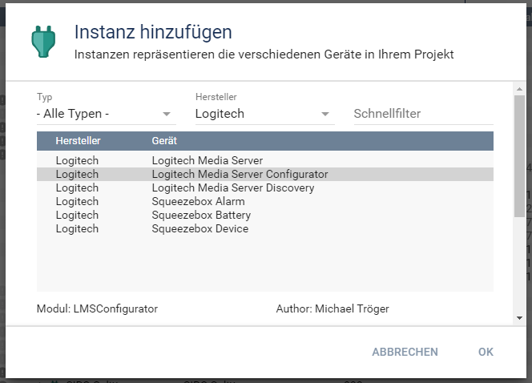

  

  

# Squeezebox Konfigurator  
Vereinfacht das Anlegen von verschiedenen SqueezeBox-Instanzen.  

## Dokumentation

**Inhaltsverzeichnis**

1. [Funktionsumfang](#1-funktionsumfang)  
2. [Voraussetzungen](#2-voraussetzungen)  
3. [Software-Installation](#3-software-installation) 
4. [Einrichten der Instanzen in IP-Symcon](#4-einrichten-der-instanzen-in-ip-symcon)
5. [Statusvariablen und Profile](#5-statusvariablen-und-profile)
6. [WebFront](#6-webfront)
7. [PHP-Befehlsreferenz](#7-php-befehlsreferenz) 
8. [Lizenz](#8-lizenz)

## 1. Funktionsumfang

 - Auslesen und darstellen aller im LMS und IPS bekannten Geräte und Instanzen.  
 - Einfaches Anlegen von neuen Instanzen in IPS.  

## 2. Voraussetzungen

 - IPS 5.0 oder höher
 - Logitech Media Server (getestet ab 7.9.x)
 - kompatibler Player

## 3. Software-Installation

 Dieses Modul ist Bestandteil der IPSSqueezeBox-Library.
   *Über das 'Modul Control' folgende URL hinzufügen:  
    `git://github.com/Nall-chan/IPSSqueezeBox.git`  

## 4. Einrichten der Instanzen in IP-Symcon

Eine einfache Einrichtung ist über die im Objektbaum unter 'Discovery Instanzen' zu findene Instanz [Logitech Media Server Discovery](../../LMSDiscovery/readme.md) möglich.  

Bei der manuellen Einrichtung ist das Modul ist im Dialog 'Instanz hinzufügen' unter dem Hersteller 'Logitech' zufinden.  
  

Alternativ ist es auch in der Liste alle Konfiguratoren aufgeführt.  
  

Es wird automatisch eine LMSSplitter Instanz erzeugt, wenn noch keine vorhanden ist.  
Werden in dem sich öffnenden Konfigurationsformular keine Geräte angezeigt, so ist zuerst der Splitter korrekt zu konfigurieren.  
Dieser kann über die Schaltfläche 'Gateway konfigurieren' erreicht werden.  
Details dazu sind der Dokumentation des Splitters zu entnehmen.

Ist der Splitter korrekt verbunden, wird beim öffnen des Konfigurator folgendender Dialog angezeigt.  
  

Über das selektieren eines Eintrages in der Tabelle und betätigen des dazugehörigen 'Erstellen' Button,  
können alle Instanzen in IPS angelegt werden.  

## 5. Statusvariablen und Profile

Der Konfigurator besitzt keine Statusvariablen und Variablenprofile.  

## 6. WebFront

Der Konfigurator besitzt keine im WebFront darstellbaren Elemente.  

## 7. PHP-Befehlsreferenz

Der Konfigurator besitzt keine Instanz-Funktionen.  

## 8. Lizenz

  IPS-Modul:  
  [CC BY-NC-SA 4.0](https://creativecommons.org/licenses/by-nc-sa/4.0/)  
